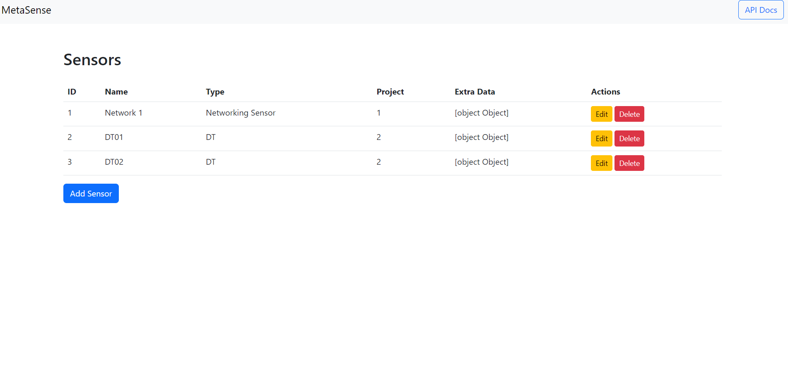

# MetaSense: A Smart Sensor Network Management Platform

MetaSense is a powerful and extensible platform for managing and visualizing data from various sensors across multiple projects. It provides an API for programmatic interaction, a user-friendly web interface for managing sensors and data, and advanced features like map-based visualization and real-time sensor status tracking.

## Table of Contents

- [Features](#features)
- [Demo](#demo)
- [Installation](#installation)
- [Configuration](#configuration)
- [Usage](#usage)
- [API Endpoints](#api-endpoints)
- [Tech Stack](#tech-stack)
- [Contributing](#contributing)
- [License](#license)

---

## Features

- **Sensor Management**: Add, edit, and delete sensors associated with projects.
- **Data Visualization**: View and paginate sensor data efficiently.
- **Interactive Maps**:
  - Display sensor locations with real-time status (online/offline).
  - Color-coded markers for active (green) and inactive (red) sensors.
- **RESTful API**:
  - Fully documented API with Swagger for easy integration (Work In Progress...).
- **Responsive UI**:
  - Built with Bootstrap for an intuitive and mobile-friendly design.
- **Pagination**: Handle large datasets seamlessly with server-side pagination.

---

## Demo

*Screenshot of the Home Page.*

*Screenshot of the Projects Page.*

*Screenshot of the Sensors Page.*

*Screenshot of the Home Page.*


---

## Installation

Follow these steps to set up the project locally:

### Prerequisites

- Python 3.6 or higher
- PostgreSQL
- Node.js (optional, for advanced development)

### Clone the Repository

```bash
git clone https://github.com/your-username/metasense.git
cd metasense
